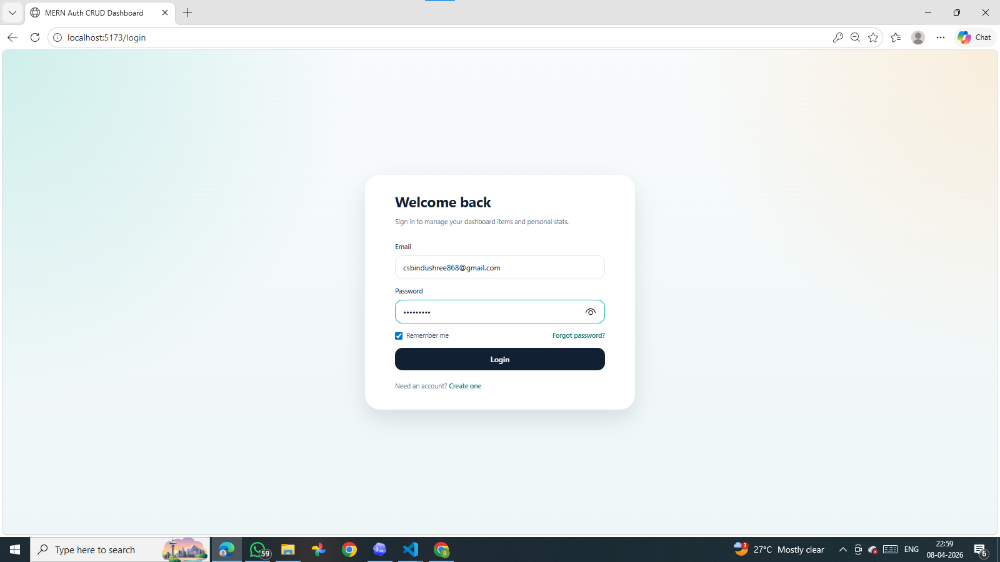
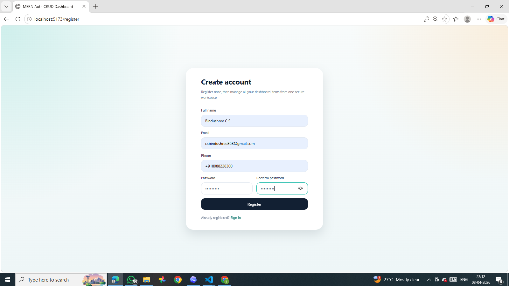
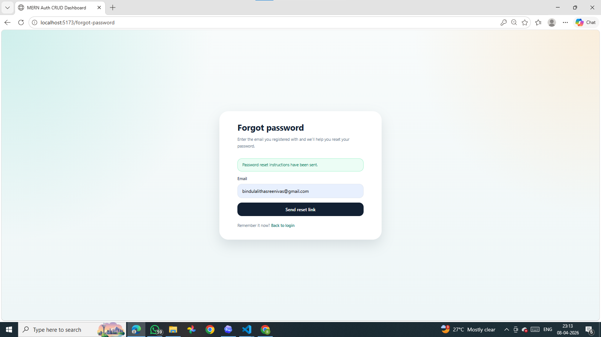
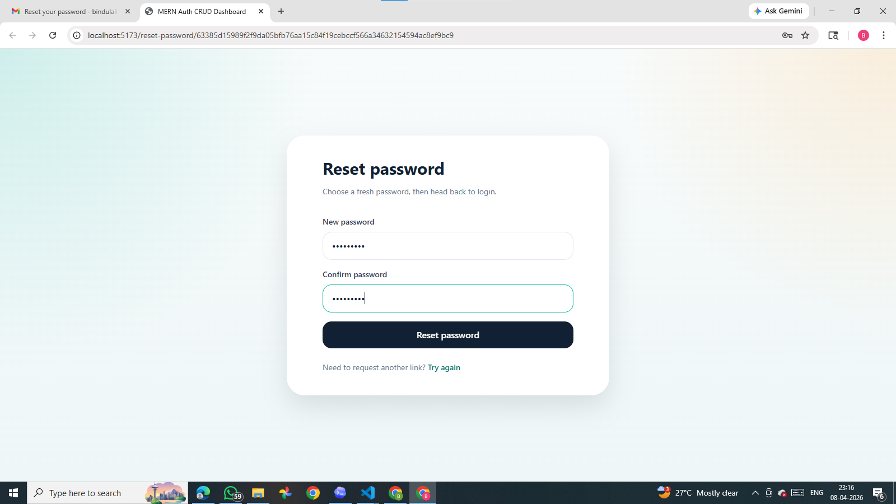
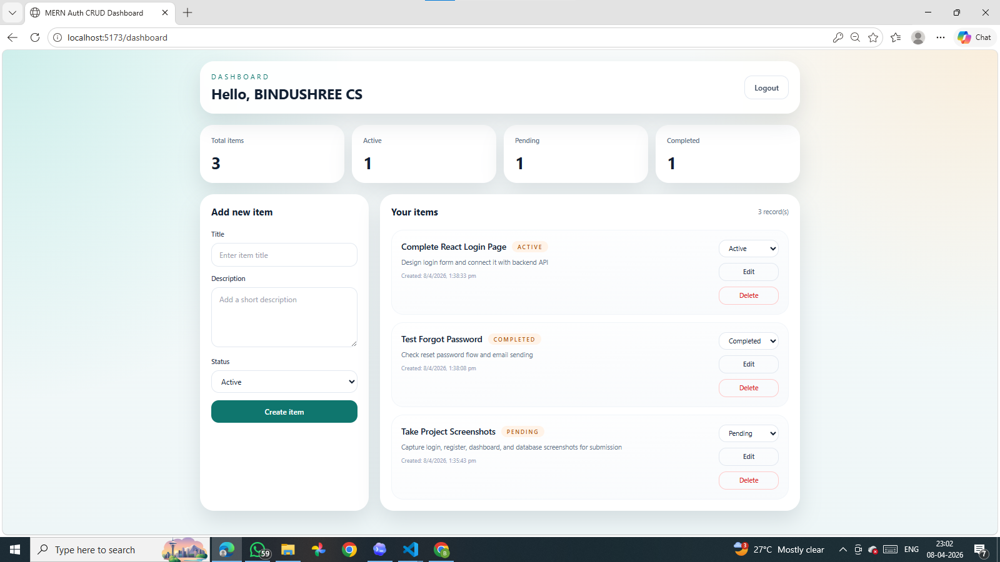

# MERN Stack Authentication & CRUD with MySQL

## Project Description

This project is a full-stack web application built using React, Node.js, Express.js, and MySQL. It includes user authentication and a dashboard with full CRUD functionality for managing user-specific items.

## Features

- user registration and login
- JWT-based authentication
- forgot password and reset password
- protected dashboard
- create, read, update, and delete items
- dashboard statistics
- MySQL data storage

## Tech Stack

- React.js
- Node.js
- Express.js
- MySQL
- React Router
- Axios
- Tailwind CSS
- mysql2
- bcryptjs
- jsonwebtoken
- nodemailer

## Project Structure

```text
New project/
|-- backend/
|   |-- config/
|   |-- controllers/
|   |-- middleware/
|   |-- routes/
|   |-- utils/
|   |-- .env.example
|   |-- database.sql
|   |-- package.json
|   `-- server.js
|-- frontend/
|   |-- public/
|   |-- src/
|   |   |-- api/
|   |   |-- components/
|   |   |-- context/
|   |   |-- App.jsx
|   |   |-- index.css
|   |   `-- main.jsx
|   |-- .env.example
|   `-- package.json
|-- screenshots/
|-- postman_collection.json
`-- README.md
```

## Screenshots

### Login Page



### Register Page



### Forgot Password Page



### Reset Password Page



### Dashboard Page



### Database Users Table


### Database Items Table


## Submission Notes

- test all features before submission
- keep the GitHub repository public
- include backend, frontend, database.sql, screenshots, and README
- do not upload real `.env` credentials

## Author

Bindushree CS

## Conclusion

This project demonstrates a complete MERN-style authentication and CRUD application using MySQL as the database. It includes secure user authentication, password reset functionality, protected routes, and a responsive dashboard for managing items efficiently.
